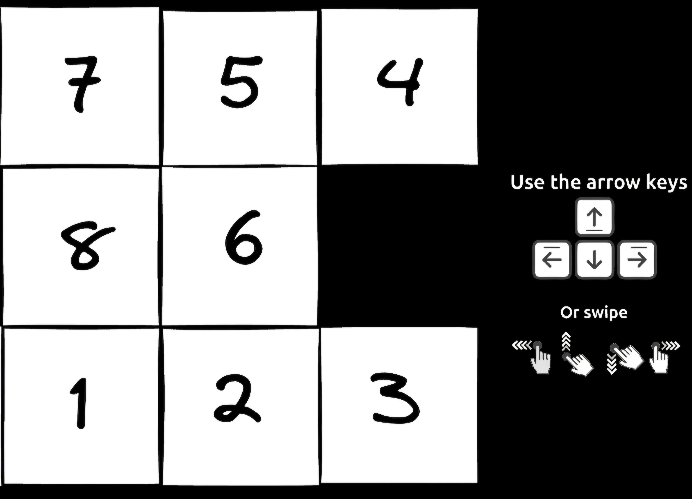

# puzzle

Puzzle game in Go

## Dependencies
- Go 1.22
- [Ebiten](https://github.com/hajimehoshi/ebiten/v2)

## WASM

To build to WASM just run `make build`:

- The files you need to serve are inside `docs` folder
- It is possible to test it locally by running `make start`. A file server will start at port `:8080`

